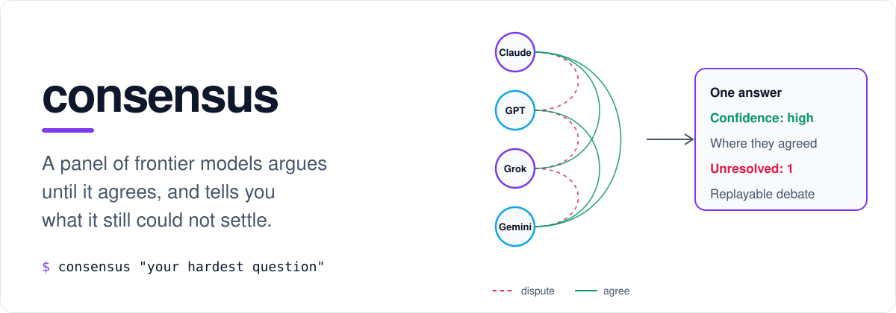
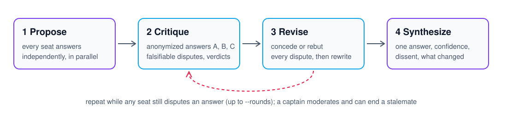

<p align="center">
  <picture>
    <source media="(prefers-color-scheme: dark)" srcset="docs/assets/hero-dark.svg">
    
  </picture>
</p>

<p align="center">
  <a href="https://www.npmjs.com/package/consensus-panel"></a>
  <a href="https://github.com/seanheiney/consensus/actions/workflows/ci.yml"></a>
  <a href="LICENSE"></a>
  
  
</p>

<p align="center">
  <a href="#quickstart">Quickstart</a> ·
  <a href="#what-you-get-back">What you get back</a> ·
  <a href="#does-it-actually-help">Evidence</a> ·
  <a href="#use-it-from-your-agent">Agents &amp; MCP</a> ·
  <a href="#in-ci">GitHub Action</a> ·
  <a href="docs/README.md">Docs</a>
</p>

---

One model gives you one confident answer. **consensus** puts the question to a panel instead: Claude, GPT, Grok and Gemini answer independently, attack each other's answers anonymously, concede or rebut every dispute, and revise until they agree. You get **one answer the whole panel signed off on**, its confidence, and the disagreements that survived, laid out honestly instead of averaged away.

It runs on the **subscriptions you already pay for** (Claude Pro/Max, ChatGPT Plus/Pro, SuperGrok) by driving each vendor's own CLI in a verified clean room, or on API keys, OpenRouter, Groq, Ollama or any OpenAI-compatible endpoint. CLI, MCP server, GitHub Action and TypeScript library.

## Quickstart

```bash
npm install -g consensus-panel      # or the one-liner below: no Node needed
consensus setup                     # finds your accounts, builds panels, teaches your IDEs, runs a first debate
consensus "Should this queue move from Postgres SKIP LOCKED to Redis/BullMQ?" -c src/queue.ts
```

```bash
curl -fsSL https://raw.githubusercontent.com/seanheiney/consensus/main/install.sh | sh          # macOS / Linux
irm https://raw.githubusercontent.com/seanheiney/consensus/main/install.ps1 | iex               # Windows
```

You need two model connections for a panel, or one with `--variants 4` (the same model seated under four reasoning angles). `consensus doctor` tells you what is connected and what is missing. One `OPENROUTER_API_KEY` reaches every vendor.

## What you get back

A real run, lightly trimmed: Claude Haiku 4.5 seated three times under the `debug` angles, GPT-5.6 Sol as captain, and a `--verify` grounding pass over the result.

```text
$ consensus "A payment service retries a failed charge 3 times with no idempotency key.
             Name the concrete failure this causes." \
    -p claude:claude-haiku-4-5-20251001 --for debug -e low --verify

# Answer
The concrete failure is duplicate charges: the customer may be charged multiple times for one transaction.
This occurs when the original charge succeeds at the processor but its response is lost or times out. […]

# Confidence
High — all provided answers agree.

# Unresolved disagreements
- None.

Grounding check by codex:gpt-5.6-sol: 4 load-bearing claims checked against the material given
  — 1 supported, 0 contradicted, 3 not established by that material.
  - unsupported: the charge succeeding while its response is lost — the problem never says any attempt succeeded.
  - unsupported: "up to four identical charges" — nothing establishes that every attempt can create a charge.

Dropped: the enumerator seat hit its weekly usage limit in round 1; the other two carried on.
Isolation: 4/4 seats clean (3 observed at startup with no tools or MCP servers; 1 by lockdown flags)
Panel converged after 1 round. Cost: subscription quota (~$0.32 list-price equivalent).
```

The panel agreed, and the grounding check still separated what the question established from what the panel assumed. That separation is the point. Every run is saved, and `consensus log` replays the full debate: each answer, every dispute, every concession and rebuttal.

## How it works

<picture>
  <source media="(prefers-color-scheme: dark)" srcset="docs/assets/protocol-dark.svg">
  
</picture>

- **Anonymous.** Answers are shown as A, B, C (shuffled once per run), so no seat defers to a brand.
- **Concede or rebut.** Every dispute gets an answer with a reason. A critique cannot be ignored.
- **Unanimous or it keeps going.** One dissenting seat keeps the debate open, up to `--rounds`. A captain (by default the best model available) moderates, referees disputes it can settle, and ends a stalemate by reporting it.
- **Honest output.** The report keeps unresolved disagreements, with each side's strongest case, and says what changed during review. A seat that fails is dropped and the run continues, with exit code 2 so scripts notice.

## Does it actually help?

Measured, not asserted: [docs/evidence.md](docs/evidence.md). On eight open design and operations decisions with expert-written rubrics, blind graders from two vendors preferred the debated answer over either single frontier model on **7–8 of 9 paired cases**, and scored it highest on rubric accuracy. Against the same model sampled three times and self-merged, one grader preferred the panel 7–1–1 and the other called it even.

It is not free: a full frontier debate took about **22× the time** of one answer. On easy questions a single model is already right, and the panel mostly adds polish. So use a panel where being wrong is expensive, and use the cheap tools below everywhere else. `consensus bench` runs the same comparison on your own questions.

## Cheap by default, expensive when it earns it

```bash
consensus check "Is this migration safe to run online?" -c 0042.sql     # one answer per model, no debate; exit 1 when they split
consensus "Is this design sound?" -P groq-fast --escalate frontier     # open-weight panel in seconds; promote only if unsettled
consensus "Review this migration" -c plan.sql --for code-review        # the reasoning angles that fit the work
consensus "Optimistic locking or a distributed lock?" --variants 4     # a real debate on a single subscription
```

- **`consensus check`** uses disagreement between models as an uncertainty detector: one call per seat, then `Needs human: yes|no` to gate an agent or a CI job on.
- **`--escalate`** answers with the cheap panel and promotes to the strong one only when the first pass did not converge, left a major dispute open, or reported confidence below high.
- **`groq-fast` / `groq-council`** seat Groq's open-weight models under different angles once `GROQ_API_KEY` is set. A debate then takes seconds and costs a fraction of a cent.

## Trust you can check

| Feature | What it does |
|---|---|
| **Grounding** | `--verify` marks each load-bearing claim in the report supported, contradicted or unsupported by the material you supplied. |
| **Quarantine** | `--untrusted SKILL.md` reads third-party plugins, skills, READMEs or PRs as data inside per-run delimiters with a canary token. Seats report injection attempts, and a seat that leaks the canary is excluded. Try the `plugin-review` pack on the [harmless demo plugin](examples/injection-demo/): [docs/quarantine.md](docs/quarantine.md). |
| **Clean rooms, observed** | Seats see only your prompt: no files, no instruction files, no MCP servers, no other vendors' keys. Every run ends with a line such as `Clean rooms: 3/3 seats observed clean` that separates isolation the CLI reported from isolation that is only configured. [docs/isolation.md](docs/isolation.md) |
| **Calibration** | `consensus outcome latest right` records how a decision turned out, and `consensus calibration` shows whether "high confidence" actually meant right more often, or says there is too little data to tell. |
| **Decision records** | `consensus adr` writes the decision, confidence, dissent and a replay command to `docs/decisions/`. `consensus adr --recheck --all` re-asks them with today's models and exits 1 if one changed. [docs/decisions.md](docs/decisions.md) |

## Use it from your agent

`consensus setup` registers the MCP server and a skill in Claude Code, Codex, Gemini CLI, Grok, Cursor, Windsurf and Claude Desktop, so your agent knows when to reach for a panel. Then just ask: *"Get a panel consensus on whether we should move this queue to Kafka; include the producer code."*

```bash
claude mcp add -s user consensus -- consensus mcp      # or register it by hand
codex mcp add consensus -- consensus mcp
```

Tools: `consensus` (run a panel, with `variants`, `escalate_to`, `verify`, `untrusted`), `consensus_check`, `consensus_outcome`, `consensus_profiles`, `consensus_design`. Details in [docs/usage.md](docs/usage.md#mcp-server).

## In CI

```yaml
- uses: seanheiney/consensus@v0.3.0
  with:
    prompt: Review this diff for correctness, security and operational risk.
    context-file: /tmp/diff.patch
    profile: groq-fast
    for: code-review
    verify: "true"
    comment: "true"          # post the report on the pull request
    max-cost: "0.50"
  env:
    GROQ_API_KEY: ${{ secrets.GROQ_API_KEY }}
```

`mode: check` gives a cheap gate that debates only on a split. Other recipes cover escalation, `/consensus` comments and monthly decision rechecks: [docs/ci.md](docs/ci.md).

## Your subscriptions, and the fine print

| Vendor | Subscription seat | API key |
|---|---|---|
| Anthropic | `claude` (Claude Code) on Claude Pro/Max | `ANTHROPIC_API_KEY` |
| OpenAI | `codex` on ChatGPT Plus/Pro | `OPENAI_API_KEY` |
| xAI | `grok` CLI | `XAI_API_KEY` |
| Google | — (the free individual Gemini CLI login was retired) | `GEMINI_API_KEY` |
| Anything else | — | `OPENROUTER_API_KEY`, `GROQ_API_KEY`, Ollama, `compat:<model>@<baseURL>` |

A subscription seat is the vendor's own CLI, run headless in an empty directory with its tools, plugins and MCP servers switched off and an allow-listed environment. Consensus never sees your subscription token.

**Read this before relying on subscription seats.** They spend the same rate limits as your interactive use of those CLIs, and a three-round frontier debate can take a real slice of a daily cap. The vendors' terms govern this use, and Anthropic's restrict third-party products from relying on claude.ai logins. Consensus is a local tool you run under your own login, not a hosted service. Checking your plan's terms is on you, and anything shared or automated should use API keys. [More in the FAQ.](docs/faq.md#does-it-use-my-subscription-and-am-i-allowed-to-do-that)

## Documentation

| Guide | What is in it |
|---|---|
| [Install](docs/install.md) | Every install path, what the installer writes where, upgrading, uninstalling, troubleshooting |
| [Usage](docs/usage.md) | CLI reference by task, the `provider[:model][#effort][+persona]` seat grammar, profiles, personas, packs, bench, MCP, library |
| [CI](docs/ci.md) | The GitHub Action: PR review, the `check` gate, escalation, comment commands |
| [Evidence](docs/evidence.md) | Ablations against single models and self-consistency, with raw results |
| [Quarantine](docs/quarantine.md) · [Clean rooms](docs/isolation.md) · [Decisions](docs/decisions.md) | The trust features in depth |
| [FAQ](docs/faq.md) | Cost, terms, privacy, dropped seats, "why no revision with `--rounds 1`" |
| [Packs](PACKS.md) | Share a panel (profiles, personas, a bench suite) as one JSON file |

## Library

```ts
import { runConsensus, resolveRun, loadConfig, renderReport } from "consensus-panel";

const cfg = await loadConfig();
const { panel, judge, rounds, effort } = await resolveRun({ cfg, profile: "frontier" });
const run = await runConsensus("Design a rate limiter for a multi-tenant API", { panel, judge, rounds, effort });
console.log(renderReport(run));
```

Bring your own model by implementing `Panelist` (`id`, `provider`, `model`, `complete(request)`).

## Contributing

```bash
pnpm install && pnpm test     # 268 tests, no keys needed
pnpm dev "..."                # run from source
```

Issues and pull requests are welcome: see [CONTRIBUTING.md](CONTRIBUTING.md). Security reports go through [SECURITY.md](SECURITY.md). Release notes are in [CHANGELOG.md](CHANGELOG.md).

MIT licensed. No telemetry.
